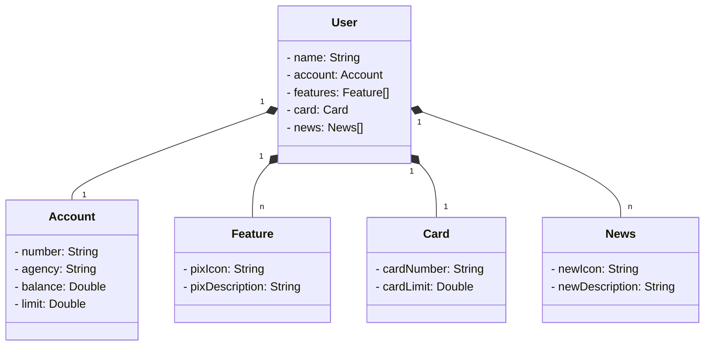

# santander-dev-week-dio-2023
Java RESTFul API criado para o Santander Dev Wek da DIO

### Diagrama de Classes 


### Estrutura JSON para criar o diagrana de classes através da sintaxe Mermaid

```json
{
  "name": "Jardel",
  "accoutn": {
    "Number": "00000000-00",
    "Agency": "0000",
    "Balance": 1324.64,
    "Limit": 1000.0
  },
  "features": [
    {
      "pixIcon": "URL",
      "pixDescription": "PIX Descrição"
    }
  ],
  "card": {
    "cardNumber": "xxxx xxxx xxxx 0000",
    "cardLimit": 1000.00
  },
  "news": [
    {
      "newIcon": "URL",
      "newDescription": "O Santander tem soluções de crédito sob medida pra você."
    }
  ]
}
```
